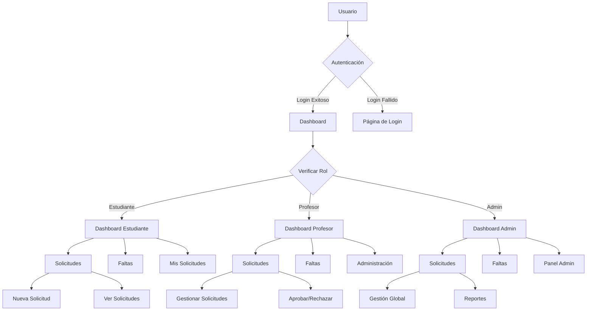
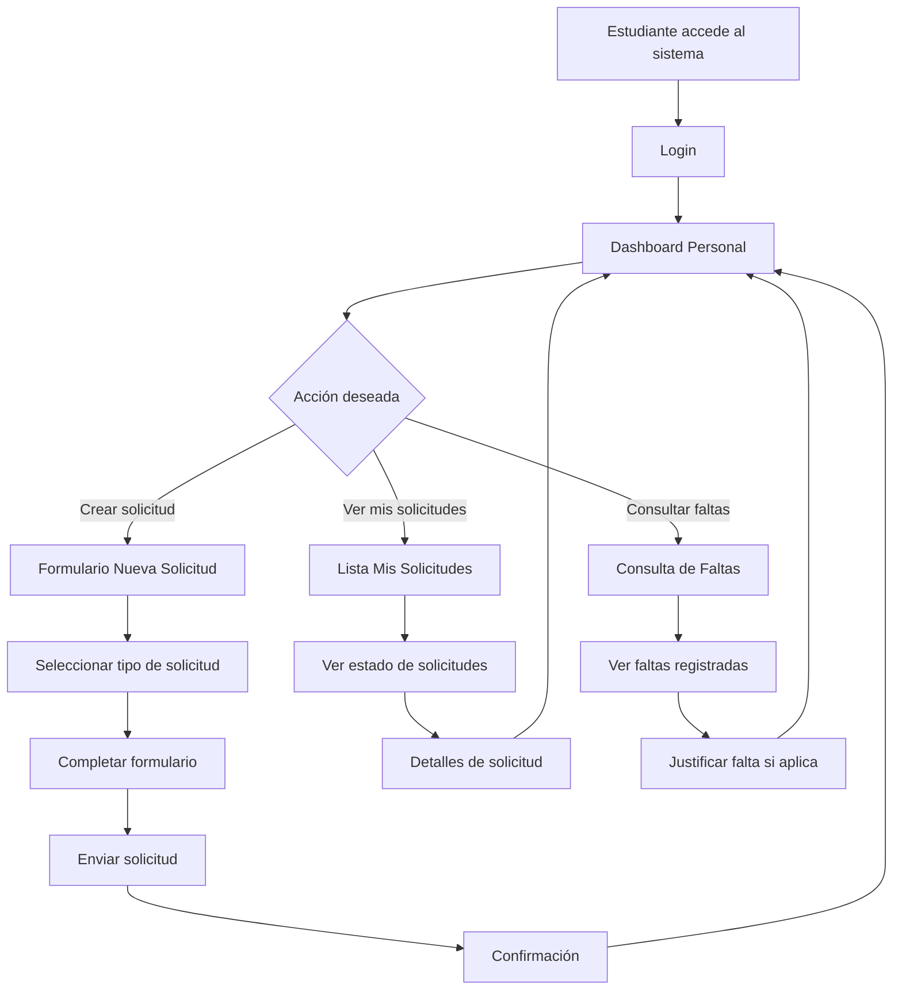
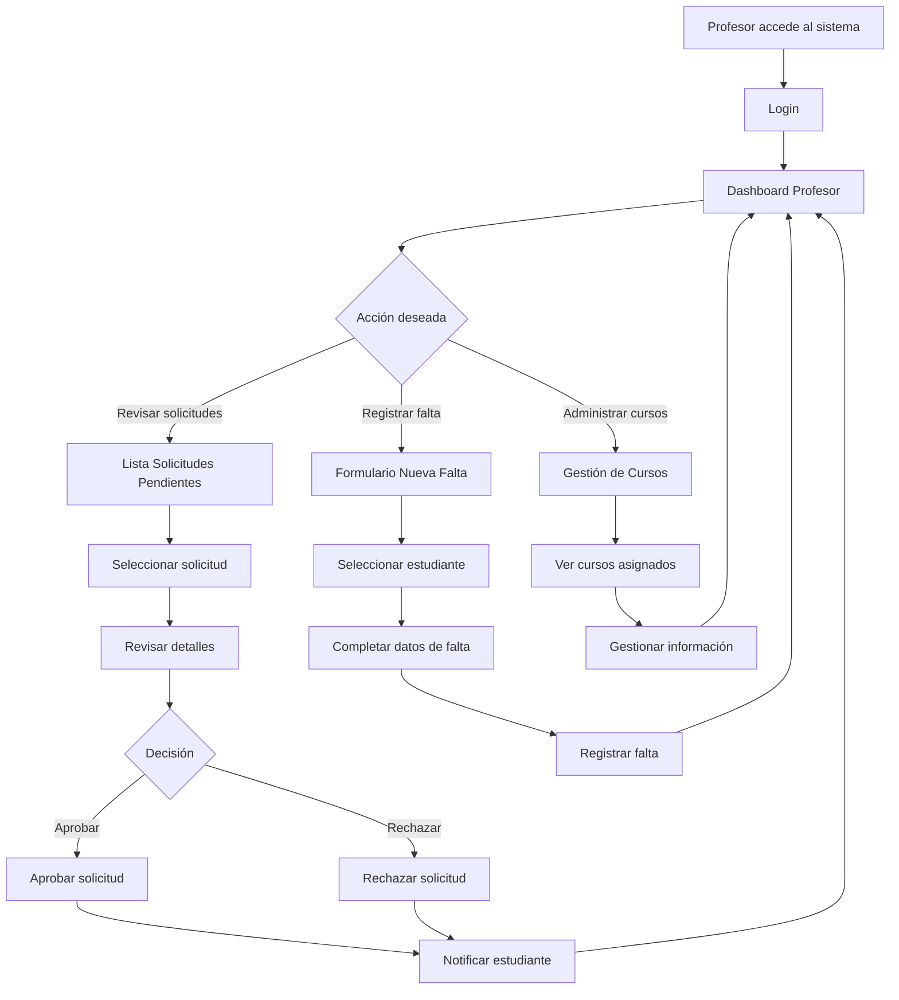
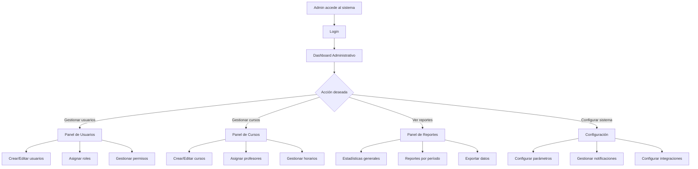
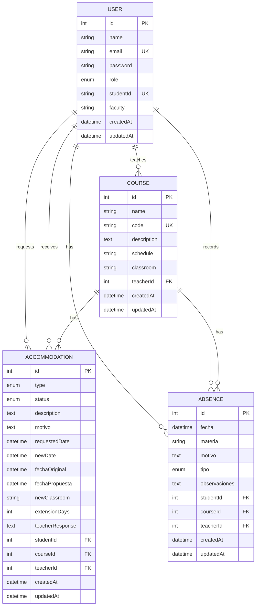
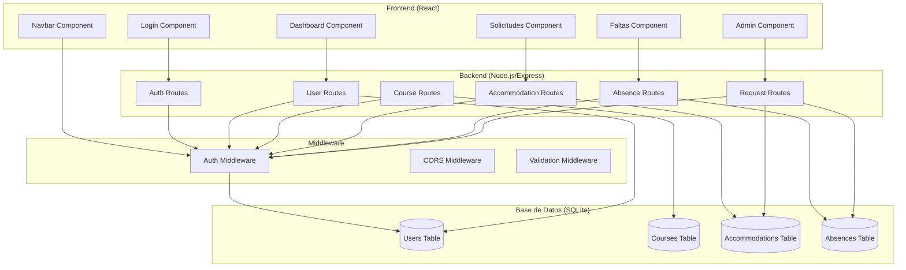
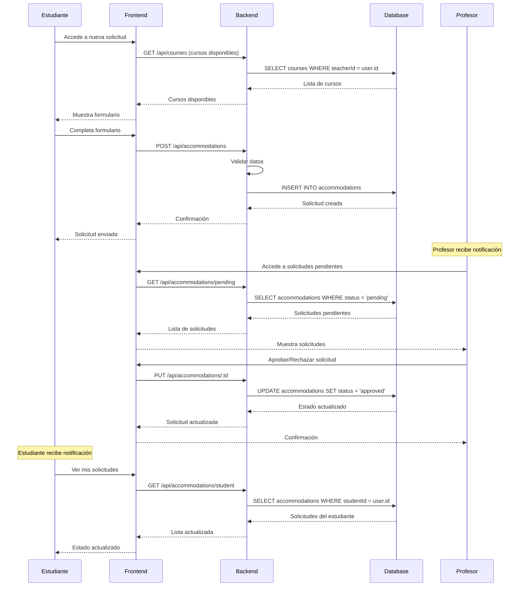
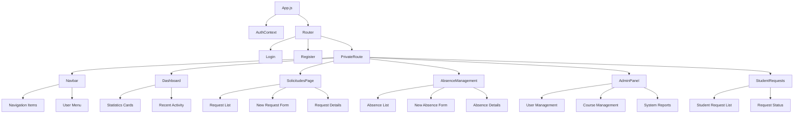
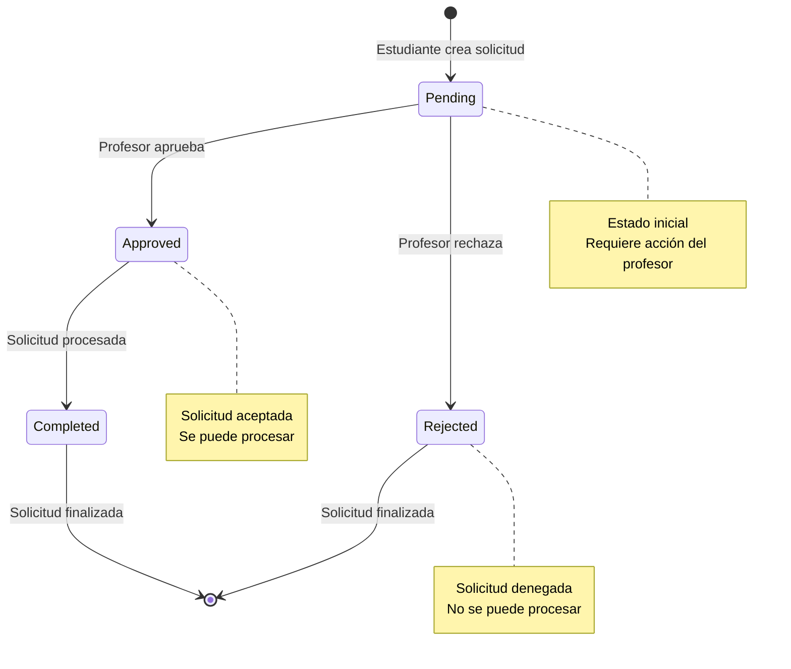
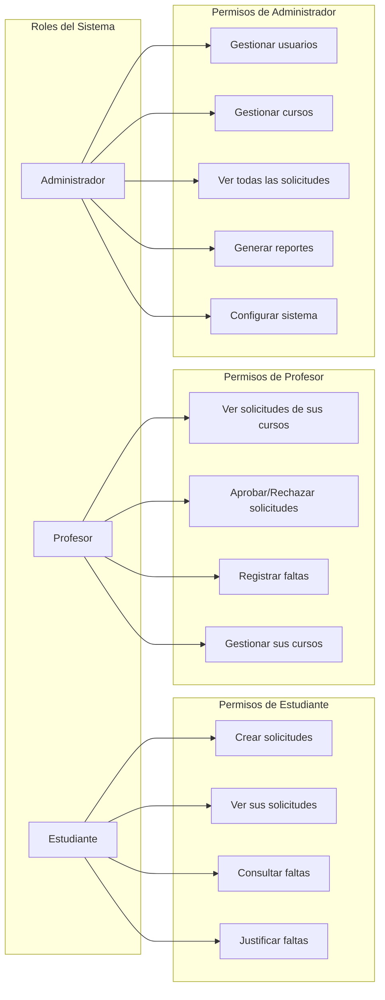

# DIAGRAMAS DE ARQUITECTURA Y MODELO DE DATOS

## Diagrama de Arquitectura de Navegación

## Diagrama de Flujo de Usuario - Estudiante

## Diagrama de Flujo de Usuario - Profesor

## Diagrama de Flujo de Usuario - Administrador

## Diagrama de Modelo de Datos (ER)

## Diagrama de Arquitectura del Sistema

## Diagrama de Flujo de Datos - Solicitud de Acomodación

## Diagrama de Componentes Frontend

## Diagrama de Estados de Solicitud

## Diagrama de Roles y Permisos

Estos diagramas proporcionan una representación visual completa de la arquitectura de navegación, el modelo de datos, los flujos de usuario y la estructura del sistema del Sistema de Solicitudes Académicas.

